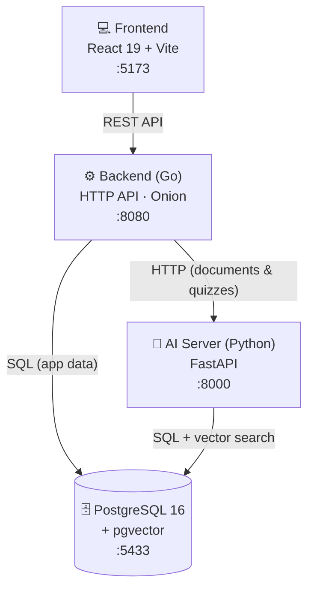
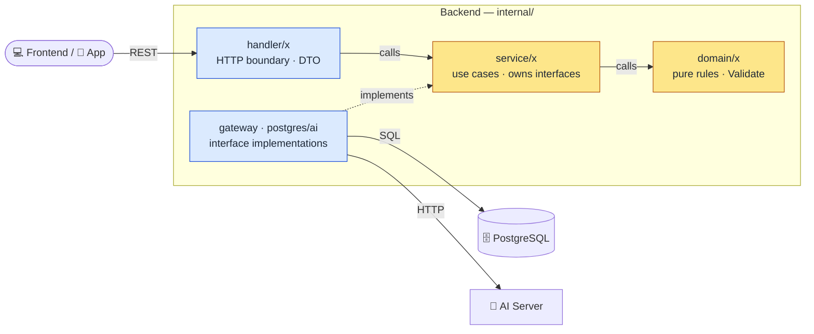
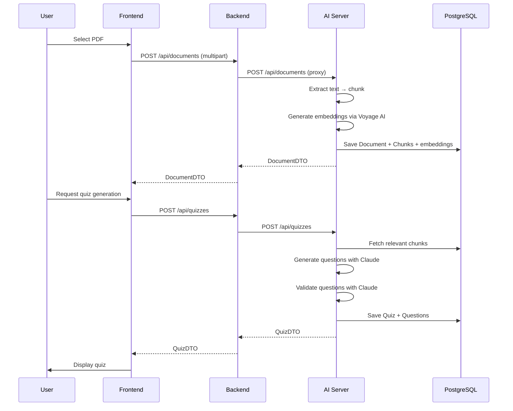

<div align="center">

# 🦊 Voro

**AI study assistant built around lecture materials** — upload a PDF and Claude
automatically generates multiple-choice quizzes, while you manage timetables,
alarms, and exam dates, all in one mobile study app.

<br/>


</div>

---

## ✨ Features

- 📄 **Note upload → AI quiz generation** — upload a lecture PDF; after embedding & chunking, Claude generates and validates multiple-choice questions
- 📝 **Quiz play & review** — save attempts, review results, browse history
- 🗓️ **Timetable (classes)** — register classes and time slots
- ⏰ **Study alarms** — recurring alarms with a master on/off
- 📅 **Exam-day (D-day) setup** — per-subject exam schedules with a master on/off
- 🚀 **Onboarding setup flow** — step-by-step for timetable, alarms, exams, notes
- 🔐 **Auth** — sign up / log in (session tokens)
- 📱 **Mobile app** — the same code builds to native iOS/Android via Capacitor

---

## 🏗️ System Architecture

Three independent services + a shared DB. The backend (Go) calls the AI server **over HTTP only**, and the two use **separate tables** in the same Postgres.



| Service | Role | Stack |
|---|---|---|
| **Frontend** | Mobile UI (375×812 viewport) | React 19, Vite, TanStack Router, Tailwind CSS v4, Capacitor |
| **Backend** | Business logic + REST API | Go 1.25, `net/http`, pgx/v5 |
| **AI Server** | PDF ingestion & embedding, quiz generation & validation | Python 3.12, FastAPI, Claude Sonnet, Voyage AI |
| **Infra** | Database | PostgreSQL 16 + pgvector (Docker) |

---

## 🧅 Backend Layers (Onion Architecture)

Dependencies point **inward only**: `handler → service → domain`.
The outside (`gateway`) **implements interfaces defined by `service`** and is injected in (dependency inversion).



| Layer | Location | Role | Must not |
|---|---|---|---|
| **domain** | `internal/domain/` | Pure types, rules, `Validate` | I/O, JSON tags, framework imports |
| **service** | `internal/service/<x>/` | Use cases. Depends only on its own interface (`interface.go`) | import `internal/gateway/*` |
| **gateway** | `internal/gateway/{postgres,ai}/` | DB / external HTTP impl (satisfies service interfaces) | leak transport shape into domain |
| **handler** | `internal/handler/<x>/` | HTTP boundary: DTO ↔ service | business logic |

> Core principle: **service never imports gateway.** Gateway interfaces are owned by the consumer (service).
> See [`CLAUDE.md`](./CLAUDE.md) for detailed rules and the "adding a feature" steps, and
> [`docs/architecture-review.md`](./docs/architecture-review.md) for the tech-debt roadmap.

---

## 🚀 Quick Start

### Prerequisites

- Docker Desktop · Go 1.25+ · Node.js 20+ · Python 3.12+ ([uv](https://docs.astral.sh/uv/))

### Environment variables

```bash
# AI server (required): fill in ANTHROPIC_API_KEY / VOYAGE_API_KEY / DATABASE_URL
cp ai-server/.env.example ai-server/.env

# Backend (works with defaults)
cp backend/.env.example backend/.env

# Frontend (make all copies this automatically if missing)
cp frontend/.env.example frontend/.env
```

### Run the full stack

```bash
make all
```

Open http://localhost:5173 in your browser. Press `Ctrl+C` to stop everything.

---

## 🛠️ Make Commands

| Command | Description |
|---|---|
| `make web` | Web frontend dev server (`:5173`) |
| `make app` | App (real device, dev) — auto-detects Mac LAN IP, debug build, opens Android Studio. Emulator: `make app HOST_IP=10.0.2.2` |
| `make app-release` | App (release) — uses the HTTPS URL in `frontend/.env.production`, release build |
| `make db` | Start the Postgres container only (`:5433`) |
| `make server` | Start the backend API only (`:8080`) |
| `make all` | Start db + AI + backend + web together |
| `make test` | Backend test suite (unit + e2e; isolated test DB auto-started/stopped) |
| `make stop` | Stop everything |

Utils: `make db-reset` (wipe DB) · `make db-psql` (psql shell) · bare `make` prints help.

---

## 📱 Mobile App (Capacitor)

The same web code builds to a native app.

```bash
# Dev: connect a real device to the local backend on your Mac (same WiFi required)
make app

# Release: a build that points at the HTTPS backend
make app-release
```

- **Debug build**: cleartext HTTP backend calls allowed (Android debug variant + iOS `NSAllowsLocalNetworking`).
- **Release build**: cleartext blocked — the production backend must be HTTPS. Set the deployment URL in `frontend/.env.production`.

---

## 🔌 Ports

| Port | Service |
|---|---|
| `5173` | Frontend (Vite dev) |
| `8080` | Backend (Go HTTP API) |
| `8000` | AI Server (FastAPI) |
| `5433` | PostgreSQL (host port; container internal is 5432) |
| `5434` | Test PostgreSQL (started in isolation during `make test`) |

> Port 5433 avoids conflicts with a locally installed PostgreSQL (5432).

---

## 📁 Project Structure

```
Voro/
├── backend/          # Go HTTP API (Onion Architecture)
│   └── internal/
│       ├── domain/   # pure rules
│       ├── service/  # use cases + gateway interfaces
│       ├── gateway/  # postgres · ai implementations
│       └── handler/  # HTTP boundary + DTO
├── frontend/         # React SPA (mobile web + Capacitor)
├── ai-server/        # Python FastAPI (PDF ingestion, quiz generation)
├── infra/            # docker-compose (Postgres + pgvector)
├── docs/             # architecture review, etc.
└── Makefile          # root task runner
```

---

## 🔄 Data Flow — Quiz Generation



---

## 🧪 Development Rules

- **Every feature/refactor must come with tests.** Confirm `make test` passes before finishing.
- Respect the layer roles (Onion structure above). Details in [`CLAUDE.md`](./CLAUDE.md).
