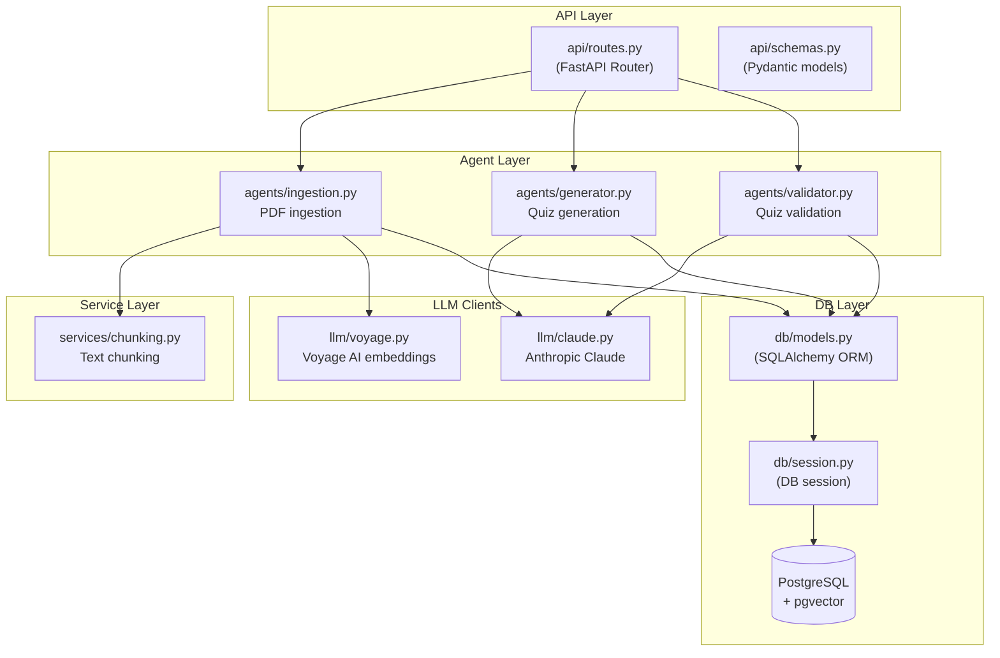
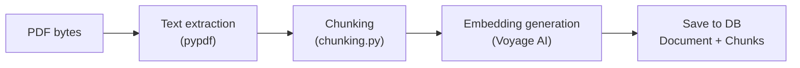
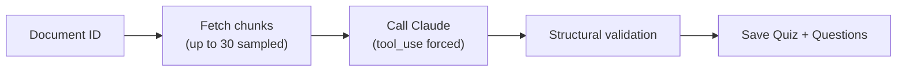
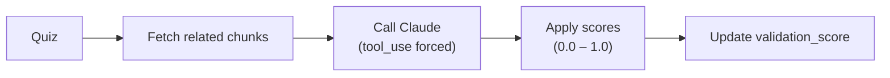
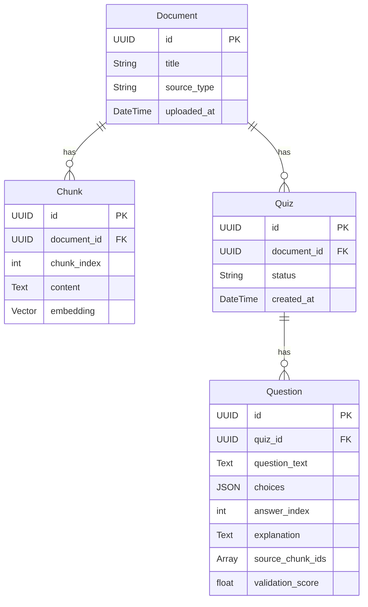
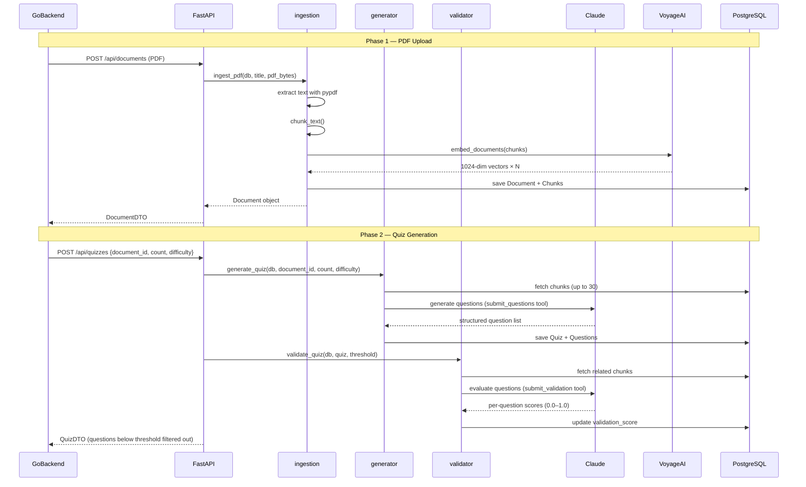

# AI Server

AI processing server built with Python FastAPI. Stores PDF documents in a vector database and uses Claude to automatically generate and validate multiple-choice quiz questions.

- **Port**: `:8000`
- **Python**: 3.12+
- **Package manager**: [uv](https://docs.astral.sh/uv/)

---

## Architecture Overview



---

## Layer Responsibilities

### api/ — HTTP Boundary

**`api/routes.py`** — FastAPI router. Validates requests with Pydantic, calls agents, and serializes responses. No business logic.

**`api/schemas.py`** — Pydantic request/response models.

```python
class QuizCreate(BaseModel):
    document_id: UUID
    count: int = Field(default=5, ge=1, le=20)
    difficulty: Literal["easy", "medium", "hard"] = "medium"
    threshold: float = Field(default=0.7, ge=0.0, le=1.0)
```

---

### agents/ — Core Business Logic

This is where the actual AI processing pipelines live.

#### `agents/ingestion.py` — PDF Ingestion



1. Extract text from PDF using `pypdf`
2. Split into chunks using `services/chunking.py`
3. Generate 1024-dimensional vector embeddings per chunk using Voyage AI (`voyage-3`)
4. Save `Document` + `Chunk` records (content + embedding) to the DB

#### `agents/generator.py` — Quiz Generation



1. Sample up to 30 chunks for the given document
2. Force Claude to call `submit_questions` tool to return structured questions
3. Validate returned fields (`answer_index`, `source_chunk_ids`, etc.)
4. Save `Quiz` + `Question` records to the DB

**Claude prompting strategy:**
- `tool_choice: {"type": "tool", "name": "submit_questions"}` forces structured output
- System prompt strictly forbids using knowledge outside the provided material
- Difficulty guides: `easy` = recall, `medium` = concept application, `hard` = reasoning & synthesis

#### `agents/validator.py` — Quiz Validation



1. Look up the source chunks referenced by each question's `source_chunk_ids`
2. Ask Claude to evaluate each question using the `submit_validation` tool across four criteria:
   - `correctness` — Is the answer grounded in the material?
   - `distractor_quality` — Are the wrong answers clearly wrong?
   - `clarity` — Is the question unambiguous?
   - `groundedness` — Does it avoid relying on external knowledge?
3. Store `overall` score (0.0–1.0) as `Question.validation_score`
4. Questions below `threshold` are filtered out from the response

---

### services/ — Utility Services

**`services/chunking.py`** — Splits long text into appropriately-sized chunks while preserving paragraph boundaries to keep semantic units intact.

---

### llm/ — LLM Clients (Singletons)

**`llm/claude.py`**

```python
DEFAULT_MODEL = "claude-sonnet-4-6"

def get_client() -> Anthropic:
    # singleton — initialized once per process
```

**`llm/voyage.py`**

```python
EMBEDDING_MODEL = "voyage-3"
EMBEDDING_DIM = 1024

def embed_documents(texts: list[str]) -> list[list[float]]: ...
def embed_query(text: str) -> list[float]: ...
```

---

### db/ — Database

**`db/models.py`** — SQLAlchemy ORM models



**`db/session.py`** — Provides a DB session as a FastAPI dependency.

> The AI server uses its own tables (`documents`, `chunks`, `quizzes`, `questions`) completely separate from the Go backend's tables (`users`, `sessions`, `alarms`, etc.). Both services share the same PostgreSQL instance but do not touch each other's tables.

---

## API Endpoints

| Method | Path | Description |
|---|---|---|
| `GET` | `/api/health` | Health check |
| `POST` | `/api/documents` | Upload + ingest a PDF |
| `GET` | `/api/documents` | List all documents |
| `DELETE` | `/api/documents/{id}` | Delete a document (cascades to chunks and quizzes) |
| `POST` | `/api/quizzes` | Generate and validate a quiz |
| `GET` | `/api/quizzes/{id}` | Get a quiz by ID |

> The Go backend proxies all of these. The frontend never calls the AI server directly.

---

## Full Quiz Generation Flow



---

## Environment Variables

`ai-server/.env` (copy from `.env.example`):

| Variable | Required | Description |
|---|---|---|
| `ANTHROPIC_API_KEY` | Yes | Claude API key |
| `VOYAGE_API_KEY` | Yes | Voyage AI embedding API key |
| `DATABASE_URL` | Yes | PostgreSQL connection string (`postgresql+psycopg://...`) |

---

## DB Migrations

Managed by Alembic.

```bash
make ai-migrate              # Apply latest migrations
make ai-revision m="message" # Auto-generate a new migration file
```

---

## Make Commands

```bash
make ai-install                  # uv sync (install dependencies)
make ai-dev                      # Run FastAPI dev server (:8000, --reload)
make ai-migrate                  # Alembic upgrade head
make ai-revision m="description" # Generate migration file
make ai-lint                     # Run ruff linter
```

---

## Tech Stack

| Library | Purpose |
|---|---|
| FastAPI 0.115 | HTTP API framework |
| SQLAlchemy 2.0 | ORM |
| Alembic | DB migrations |
| pgvector | PostgreSQL vector extension |
| Anthropic SDK | Claude API client (`claude-sonnet-4-6`) |
| Voyage AI | Text embeddings (`voyage-3`, 1024-dim) |
| pypdf | PDF text extraction |
| Pydantic v2 | Request/response validation |
| uv | Package management |
