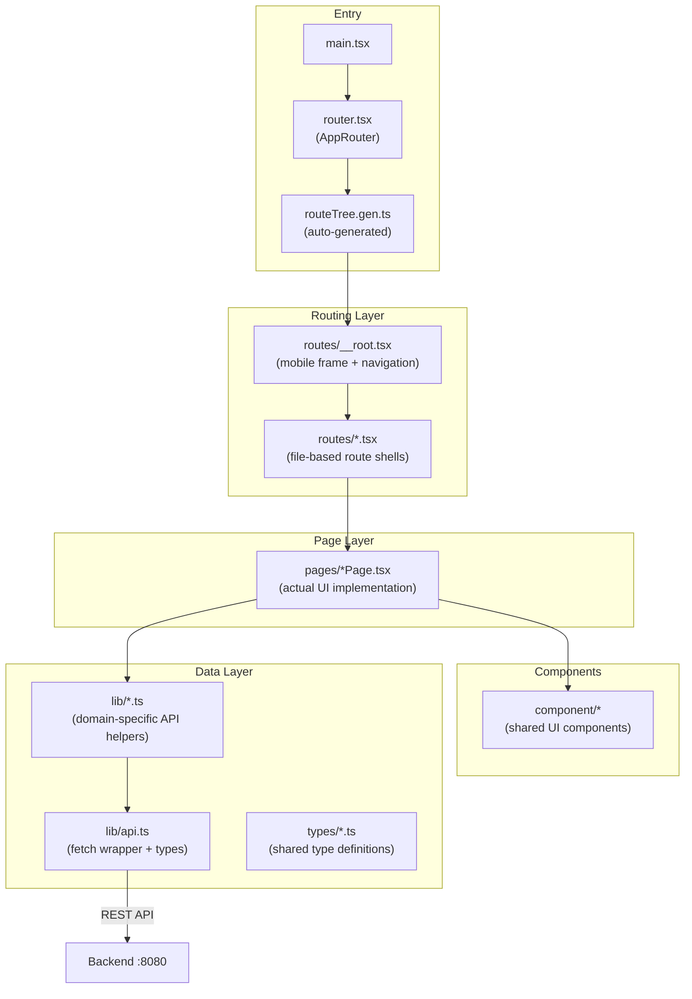
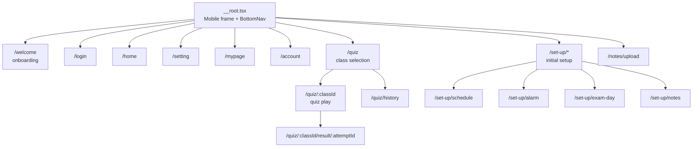
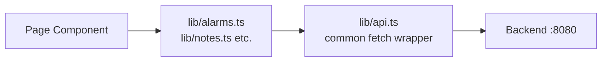

# Frontend

Mobile web app built with React 19 + Vite + TypeScript. Fixed to a 375×812 smartphone viewport. Can also be built as a native iOS/Android app via Capacitor.

- **Port**: `:5173`
- **Node.js**: 20+

---

## Architecture Overview



---

## File Structure

```
frontend/src/
├── main.tsx                    # React app entry point
├── router.tsx                  # TanStack Router setup
├── routeTree.gen.ts            # Auto-generated — do not edit manually
│
├── routes/                     # File-based routing
│   ├── __root.tsx              # Root layout (mobile frame)
│   ├── index.tsx               # / redirect
│   ├── login.tsx
│   ├── welcome.tsx
│   ├── home.tsx
│   ├── setting.tsx
│   ├── mypage.tsx
│   ├── account.tsx
│   ├── quiz/
│   │   ├── index.tsx           # /quiz
│   │   ├── $classId.tsx        # /quiz/:classId (play)
│   │   ├── $classId_.result.$attemptId.tsx
│   │   └── history.tsx
│   ├── set-up/
│   │   ├── schedule.tsx
│   │   ├── alarm.tsx
│   │   ├── exam-day.tsx
│   │   └── notes.tsx
│   └── notes/
│       └── upload.tsx
│
├── pages/                      # Page implementations
│   ├── LoginPage.tsx
│   ├── HomePage.tsx
│   ├── QuizSelectPage.tsx
│   ├── QuizPlayPage.tsx
│   ├── QuizResultPage.tsx
│   ├── QuizHistoryPage.tsx
│   ├── AlarmPage.tsx
│   ├── ExamSettingPage.tsx
│   ├── SchedulePage.tsx
│   ├── UploadNotePage.tsx
│   ├── SetupHomePage.tsx
│   ├── SetupNotesPage.tsx
│   ├── SettingPage.tsx
│   ├── MyPage.tsx
│   └── AccountPage.tsx
│
├── component/                  # Shared UI components
│   ├── BottomNav.tsx
│   ├── SideNav.tsx
│   ├── card.tsx
│   └── quiz/
│       ├── AttemptReview.tsx
│       ├── ChoiceList.tsx
│       └── ResultSummary.tsx
│
├── hooks/
│   └── useQuizSession.ts       # Quiz session state hook
│
├── lib/                        # Data access layer
│   ├── api.ts                  # Common fetch wrapper + backend types
│   ├── auth.ts                 # Login / logout / session
│   ├── quiz.ts                 # Quiz API calls
│   ├── attempts.ts             # Attempt history API calls
│   ├── notes.ts                # Lecture notes API calls
│   ├── classes.ts              # Classes API calls
│   ├── alarms.ts               # Alarm API calls
│   ├── exams.ts                # Exam schedule API calls
│   ├── setup.ts                # Onboarding step API calls
│   ├── schedule.ts             # Schedule utilities
│   ├── notifications.ts        # Capacitor local notifications
│   ├── solvedQuizzes.ts        # Local quiz history storage
│   ├── storage.ts              # localStorage utilities
│   └── validation.ts           # Input validation helpers
│
└── types/                      # Shared TypeScript types
    ├── alarm.ts
    ├── attempt.ts
    ├── exam.ts
    ├── note.ts
    ├── quiz.ts
    ├── schedule.ts
    ├── setup.ts
    └── ...
```

---

## Routing

Uses TanStack Router's **file-based routing**. The file structure under `routes/` maps 1:1 to URL paths.



**File → route rules:**
- `routes/home.tsx` → `/home`
- `routes/quiz/$classId.tsx` → `/quiz/:classId` (dynamic segment)
- `routes/set-up/alarm.tsx` → `/set-up/alarm`

> `routeTree.gen.ts` is auto-regenerated by `@tanstack/router-plugin/vite` on every `vite dev` or `vite build`. Never edit it by hand.

---

## Page Convention

Keep route files thin and delegate all UI logic to `pages/`.

```typescript
// routes/home.tsx — route shell only
import { createFileRoute } from '@tanstack/react-router'
import { HomePage } from '@/pages/HomePage'

export const Route = createFileRoute('/home')({
  component: HomePage,
})
```

```typescript
// pages/HomePage.tsx — full implementation here
export function HomePage() {
  // all component logic lives here
}
```

Always create both files together when adding a new page.

---

## API Communication

All backend API calls go through the `api` object in `lib/api.ts`.



| Feature | Behaviour |
|---|---|
| Auth headers | Reads the session token from `localStorage` and attaches `Authorization: Bearer ...` |
| 401 handling | Clears localStorage session + dispatches `voro-session-expired` event |
| Timeouts | Standard 8 s / file upload 30 s / quiz generation 120 s |
| 204 handling | Returns `undefined` with no body parsing |

---

## Styling

**Tailwind CSS v4** — no `tailwind.config.js` needed. The `@tailwindcss/vite` plugin works directly in JSX/TSX files.

Path alias `@` → `src/` is configured in `vite.config.ts`.

---

## Mobile Frame

`routes/__root.tsx` wraps the entire app in a fixed 375×812 container. The app looks like a smartphone screen even on desktop browsers.

---

## Capacitor (Native Build)

```bash
npm run cap:ios      # Build for iOS + open Xcode
npm run cap:android  # Build for Android + open Android Studio
```

Uses `@capacitor/local-notifications` to deliver study alarms and exam reminders as native push notifications.

---

## Environment Variables

`frontend/.env` (copy from `.env.example`):

| Variable | Default | Description |
|---|---|---|
| `VITE_API_BASE_URL` | `""` | Backend base URL. Empty string lets Vite proxy requests. |

---

## Make Commands

```bash
make frontend-install   # npm install
make frontend-dev       # Run dev server (:5173)
make frontend-build     # Production build (tsc -b && vite build)
```

### Frontend-only scripts (run inside `frontend/`)

```bash
npm run lint      # ESLint check
npm run preview   # Preview the production build
```

---

## Tech Stack

| Library | Version | Purpose |
|---|---|---|
| React | 19 | UI framework |
| Vite | 8 | Bundler + dev server |
| TypeScript | 5.9 | Type safety |
| TanStack Router | 1 | File-based routing + code splitting |
| Tailwind CSS | v4 | Utility-first CSS |
| Capacitor | 8 | iOS/Android native builds |
| Zod | 4 | Runtime schema validation |
| Lucide React | — | Icons |
